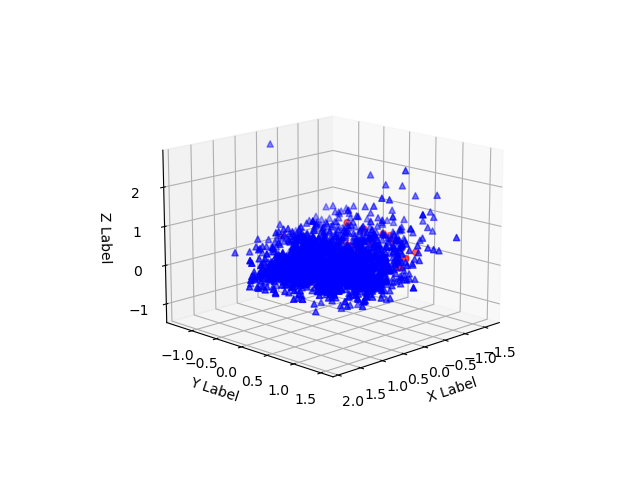
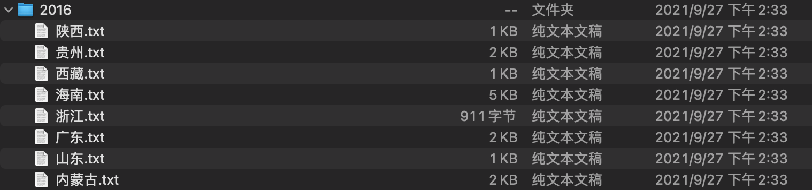

### 实验一：主成分分析+数据可视化

数据：一个样本数据，一个标签。形状是：(112, 448)，(112, 1)，numpy格式。

要求：文件中的  T32data   是特征   需要进行一次  归一化   然后进行主成分分析  提取前三大主成分   进行可视化

结果：


代码：[点我跳转](https://github.com/dlagez/bigdata/blob/master/demo1_analysis_plt/demo1_analysis_plt.py)    笔记：[点我跳转](https://github.com/dlagez/java-note-mac/blob/master/python/%E5%B0%8F%E5%AE%9E%E9%AA%8C/1.%E4%B8%BB%E6%88%90%E5%88%86%E5%88%86%E6%9E%90%26%E7%94%BB%E5%9B%BE.md)



代码：[点我跳转](https://github.com/dlagez/bigdata/blob/master/demo1_analysis_plt/demo2_analysis_plt.py)

### 实验二：LSA（潜在语意分析）

数据：有八个文本文件：



里面的内容是这个样子的：

```
（五）自然资源资产审计情况

对咸阳市、太白等“一市四县”领导干部自然资源资产责任情况开展试审。发现的主要问题：30个工业园区均未进行水资源规划论证，也未编制水土保持方案；矿山环境治理缓慢，生态恢复不到位；建设用地超规划；8个县（区）违规采砂、采石，占用河道、农田、耕地等；4个市县地下水超采严重，取水许可管理不到位；4个市县欠收水资源费、水土保持费等；3个市县挤占挪用截留专项资金；部分市县未实现城市雨污分流。

对宝鸡、渭南等7个市及所属县区2011年至2015年水污染防治资金管理及使用情况开展了审计，发现的主要问题：25个市县相关部门滞留挤占挪用专项资金；11个县区专项资金闲置超过6个月；16个县区财政配套资金未落实；17个项目建设未及时开工；56个项目建设未及时完工；14个项目违规招投标；36个项目基本建设程序不完整。
```

1.首先需要将里面的标点，数字去除。保留文本信息。

2.使用jieba分词器将词的文本提取出来。类似于下面的这个样子，只需要汉字。

```
七环境保护审计情况一自然资源资产离任审计情况按照省政府部署省审计厅组织实施了黔西南州本级及个县区领导干部自然资源资产离任审计从审计情况看这些地区大力推进生态文明建设生态环境质量逐步改善自然资源管理和环境保护总体较好审计发现的问题主要有一是森林资源管理方面存在违法征占用林地擅
```

```python
# 只保留中文，去除所有的标点以及数字。
lines = re.sub('[^\u4e00-\u9fa5]+', '', lines)
```


conda环境：使用的是mac m1 Miniforge

```bash
// 环境信息
matplotlib                3.4.3
numpy                     1.21.2
pandas                    1.3.3           
python                    3.8.12          
scikit-learn              0.24.2           
scipy                     1.7.0            
seaborn                   0.11.2            
```

