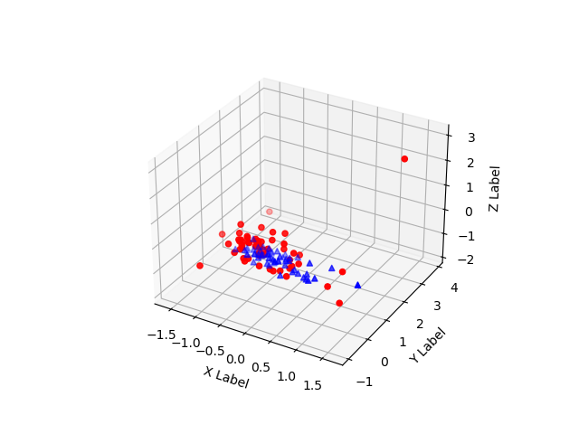

### 实验一：主成分分析+数据可视化

数据：一个样本数据，一个标签。形状是：(112, 448)，(112, 1)，numpy格式。

要求：文件中的  T32data   是特征   需要进行一次  归一化   然后进行主成分分析  提取前三大主成分   进行可视化

结果：

代码：[点我点转](https://github.com/dlagez/bigdata/blob/master/demo1_analysis_plt/demo1_analysis_plt.py)    笔记：[点我跳转](https://github.com/dlagez/java-note-mac/blob/master/python/%E5%B0%8F%E5%AE%9E%E9%AA%8C/1.%E4%B8%BB%E6%88%90%E5%88%86%E5%88%86%E6%9E%90%26%E7%94%BB%E5%9B%BE.md)

